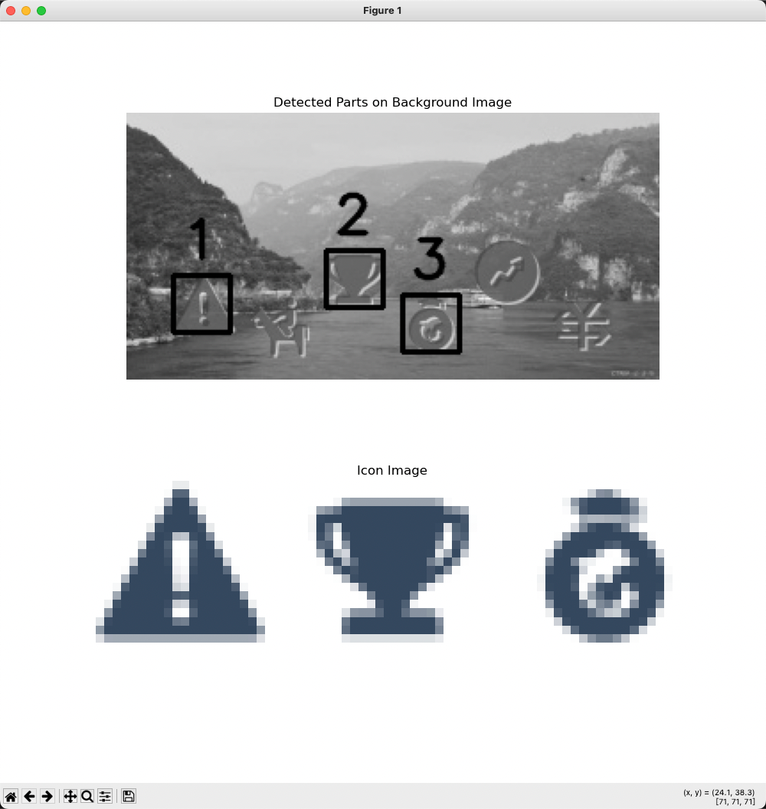
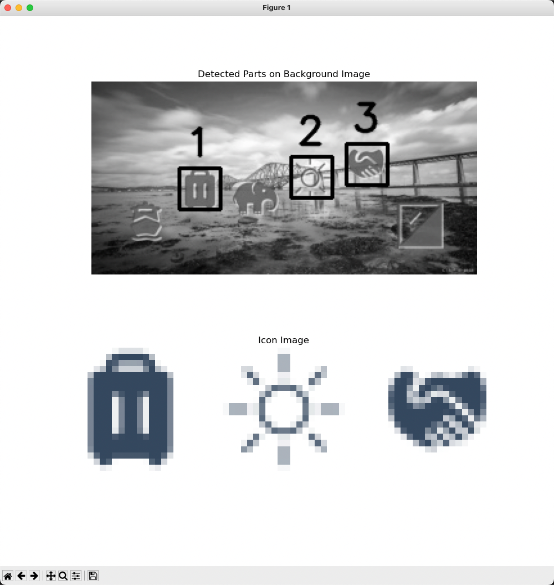

# icon_recognition
传统图像识别算法过点选验证码，ctrip测试成功率70%

## 项目来源

本项目灵感来源是低配服务器无法部署yolo模型过某程点选验证码的服务。

算法十分简单**使用传统算法进行边缘检测，进行模版匹配。** 

## 使用方法
```python 
python ctrip_verify.py
```
## 输出坐标
```shell
Part 1 matched at: (26, 91),score:33.2470703125
Part 2 matched at: (112, 77),score:43.6298828125
Part 3 matched at: (155, 102),score:34.421875
[(26, 91), (112, 77), (155, 102)]
```


## 输出效果图(可选)





## TODO
* ~~点选icon传统算法识别~~
* ~~ctrip获取验证信息接口逆向（加密、签名）~~
* 输出坐标返回ctrip服务器验证通过
* 触发二次验证的逻辑处理
* 触发滑块的识别与js逆向

## 免责声明
本项目仅供学习与交流,ctrip接口只为验证算法，请勿用做他用，如有违反本人概不负责。